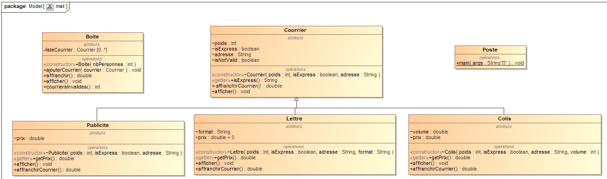

# Mail

## Topic

The principle of this program is to create a letter box that can contain either letters, packages or ads which are defined by the classes "Lettre", "Colis" and "Publicite". All those kind of mail objects inherit from a mother class called "Courrier" which means "mail".

## Description

Every letter, package or ad has a weight, an adress and is "Express" or not which is defined by a boolean value.
In addition to this, each package has a volume and each letter has a format. We are then able to say if one of these is "Valid" or not by defining some conditions on those attributs.

For instance both letters and packages have to define an adress and packages can't have a larger volume than 50 cube cm.

There is also the class Boite which contains an ArrayList of mails and there is the Poste which basically is the class that will test our entire code.

## Class Diagram

