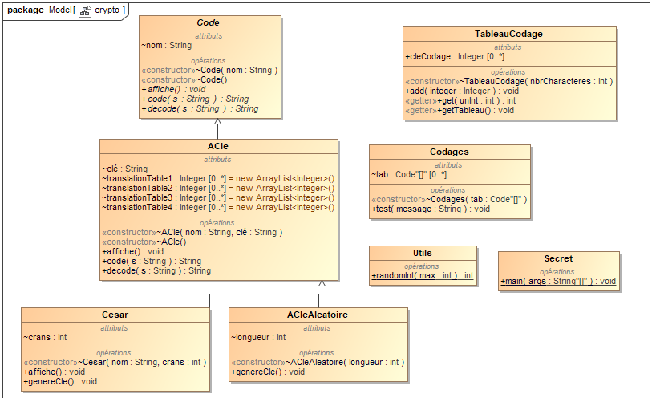

# Cryptography

## Topic

This is a very interesting program about cryptography and more particularly the Ceasar Cipher.

## Description

In this program we built 4 different kind of encrypting and decrypting systems. To do so we first defined an abstract class "Code" that will contain three important methods : affiche(), code() and decode(). Those methods will allow us to first display which encrypting system we are using and then the result of our encrypting system and decrypting system.

Then we defined a class "ACle" which will actually define the process we use to encrypt and decrypt our messages using a key. This key will be a string composed of letters like "EQUINOXE" for instance.

To process the encrypting, what we will do is change both the message and the key into a list of numbers which corresponds to their rank in tha alphabet. Then we will superimpose the message and the key so that there is no length problem (if the message length is greater than the key one, we will write the key another time and so on until it matches exactly the message length).

After that make the sum of the two superimposed numbers and make it count back from 0 if it ever gets higher than this value. Like this we get a serie of number that we then transform into a string of letters following their rank into the alphabet just the opposite of the way we did before.

At the end we get the encrypted message and display it.

There are 2 different classes that use this method. One with a predefined key which is "EQUINOXE" and corresponds to the class "ACle" and one with a generated key which is the class "ACleAleatoire". This class is using both code() and decode() methods from the ACle class and defines a generateCle() method to generate the key.

## Ceasar Cipher

In this chapter we also defined a class called Cesar that implements the Ceasar Cipher. It basically uses the code() method with a key that is one single letter and that is enough to produce a representation of a ceasar cipher.

 

## Class Diagram

This diagram shows the global architecture of the program.

