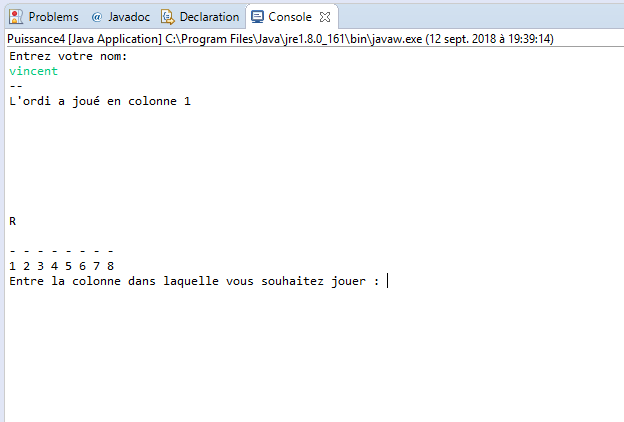
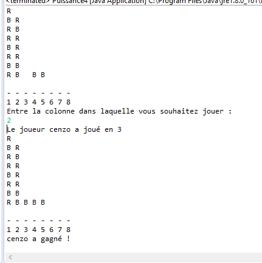
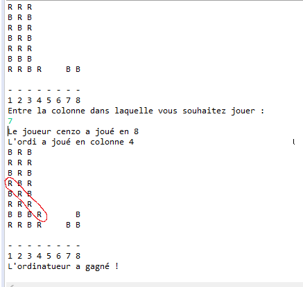
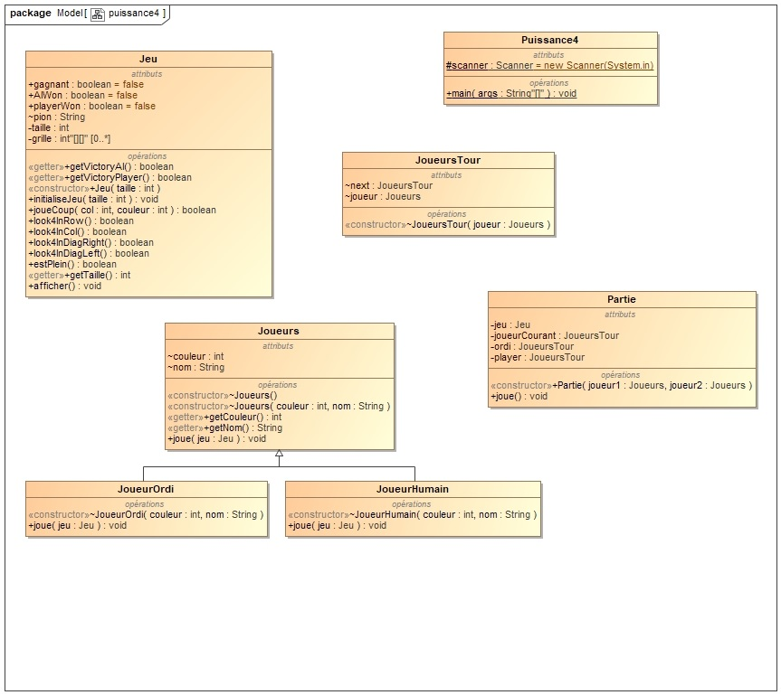

# Puissance 4

## Topic

This exercise was about coding a *Puissance 4* game. Basically, I designed this game as an array of an array so that I obtain a 2 dimensional array in order to have my rows and columns.

The game takes a number as parameter so that it is automatically designed squared.

Each player is represented by a color, either *R* for the AI or *B* for the player.

## How the players actually play 

This game makes one single player play against the AI.

The rule that makes a player allowed to play is the following. He has to chose a column, if it is full, he has to chose another one and so on. When the column is not full he can play.

Regarding how the AI plays, we went pretty easy, the program looks for the first column available and plays.

## End of the game

Like described right above, the players play while certain conditions are matched. Those conditions are that the game is not full... and that nobody wins !

#### Conditions

If the game goes full and all the columns are full, it is the end of the game.

One of the player can also win the game. This is implemented by four different methods that iterate throw the arrays and look if 4 colours are either aligned in rows, columns or diagonal.

If this is the case, the program stops and announce who won.

## Screenshots

Below you can find some screenshots of what the display of the game is like.

At the beginning the program asks for a name that has to be written is the console.
Then the AI plays first.

If someone gets 4 colours aligned, he wins.

The computer can also win obviously... and even in diagonal :

## Class diagram

Below you can find the class diagram associated with this program.

