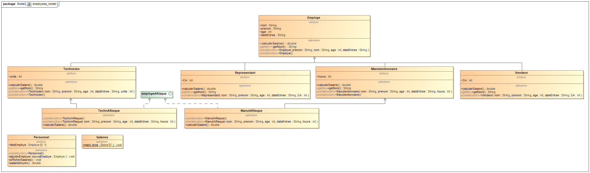

# Employees

## Topic

The main topic of week 5 is using both interfaces and the attribut static.

### Description

In this file we have many different employees having different salaries and all inheriting from a super class Employe that have different attributs.

2 different employees classes have child classes because they are workers that work in a dangerous environnement, thus, they both implements an interface called employeARisque that provides them an extra 200 euros per month on their salaries.

### Class Diagramm

