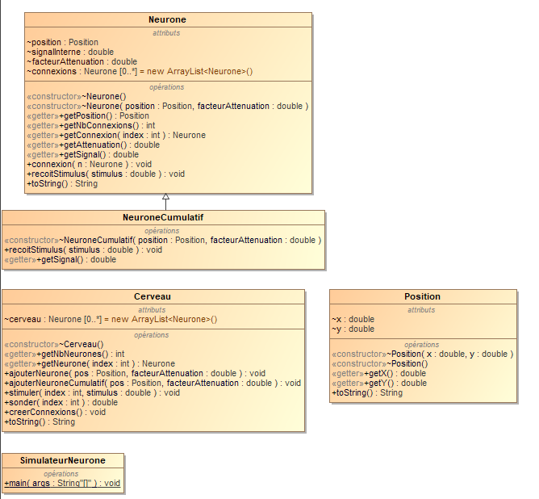

# Brain cells connectivity

## Topic

This assignment was about using pretty much everything that had been learned since the beginning of this course.
It was aboit a brain that contains different cells with many behaviour such as getting a stimulation from another brain cell with the recoitStimulus() method.
Also the brain could create connexion between its cells with the creerConexion() method and then stimulate every single cell thanks to a *ad hoc* algorythm.

The only thing tha was a bit tricky but much fun in the end is to code this *ad hoc* algorythm.

## Class diagramm

There as usual you can find my class diagramm designed on MagicDraw.

